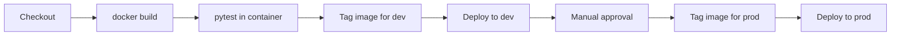

# Section 5.3: Jenkins Pipeline Example

This section explains the Jenkins pipeline included with the sample data product.

## What The Pipeline Does

The example `Jenkinsfile` follows a simple pattern:

1. check out the code
2. build the Docker image
3. run tests inside the image
4. tag the image for the dev environment
5. deploy the dev environment
6. wait for approval
7. tag and deploy the same image to production

## Why This Example Matters

The important lesson is not Jenkins-specific syntax. The important lesson is the delivery idea:

- build once
- test once
- promote the same image

## What To Look For In The Jenkinsfile

Pay attention to:

- the image repository name
- the build-number-based tag
- the test stage running against the built image
- the separate deploy steps for dev and prod

## Real-World Note

The example uses local-style image references to keep the learning setup simple.

In a more realistic team workflow, you would usually:

- push the built image to a registry
- have dev and prod hosts pull that tagged image
- keep environment-specific secrets out of the repository

## Pipeline Diagram

## Mini Quiz

1. Why is it helpful to run tests against the built image instead of only against local source files?
2. Why is a manual approval step often used before production deployment?
3. In a real setup, why would a registry usually be part of the pipeline?

## Next Step

Continue to [`04-running-the-example.md`](./04-running-the-example.md).
