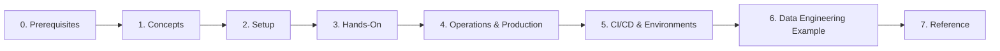

# Docker Learning the Basics

This repository is organized as a self-paced Docker course for beginners who want to move from first concepts to hands-on practice, operational thinking, CI/CD workflows, and realistic data-product examples.

It is especially useful for people in data, analytics, engineering, and platform-adjacent roles who want to:

- understand what containers are and why they exist
- run and inspect containers from the CLI
- work with ports, volumes, networks, and environment variables
- use Docker Compose for local multi-container setups
- understand production-minded deployment and security habits
- manage images and containers with Portainer
- use Docker across local, dev, and production environments
- see examples that feel relevant to Data Engineering and data products

## Learning Path

Follow the modules in order:

| Module | Focus | Outcome |
| --- | --- | --- |
| `0-prerequisites` | Installation checks | Docker is installed and working |
| `1-docker-concepts` | Core ideas | You understand images, containers, tags, and architecture |
| `2-setup` | Local environment | You verify Docker Desktop and optional Portainer |
| `3-hands-on` | Guided practice | You learn the CLI and Compose through small labs |
| `4-operations-and-production` | Production, Portainer, security | You develop better operational judgment |
| `5-cicd-and-environments` | CI/CD and environment promotion | You learn how Docker supports local dev, shared dev, and production |
| `6-data-engineering-example` | Realistic local platform | You see how Docker fits a data workflow |
| `7-reference` | Quick lookup | You have a cheatsheet and starter Compose template |
| `resources` | External reading | You know where to go deeper |

Recommended flow:

1. Read [`0-prerequisites/README.md`](./0-prerequisites/README.md)
2. Read [`1-docker-concepts/README.md`](./1-docker-concepts/README.md)
3. Complete [`2-setup/README.md`](./2-setup/README.md)
4. Work through [`3-hands-on/README.md`](./3-hands-on/README.md)
5. Continue to [`4-operations-and-production/README.md`](./4-operations-and-production/README.md)
6. Continue to [`5-cicd-and-environments/README.md`](./5-cicd-and-environments/README.md)
7. Finish with [`6-data-engineering-example/README.md`](./6-data-engineering-example/README.md)
8. Keep [`7-reference/commands-cheatsheet.md`](./7-reference/commands-cheatsheet.md) open while practicing

## Course Flow



## Quick Start

If Docker is already installed, start here:

```bash
docker run hello-world
docker run -d --name quick-nginx -p 8080:80 nginx:alpine
docker ps
docker logs quick-nginx
docker stop quick-nginx
docker rm quick-nginx
```

Then continue with [`3-hands-on/01-cli-essentials.md`](./3-hands-on/01-cli-essentials.md).

## Repository Structure

```text
Docker Learning the Basics/
├── README.md
├── 0-prerequisites/
├── 1-docker-concepts/
├── 2-setup/
├── 3-hands-on/
├── 4-operations-and-production/
├── 5-cicd-and-environments/
├── 6-data-engineering-example/
├── 7-reference/
└── resources/
```

## Example Paths In This Repo

The repository now includes several different ways to use Docker:

| Example | Purpose |
| --- | --- |
| `3-hands-on/labs/01-static-site` | Learn bind mounts with a tiny static site |
| `3-hands-on/labs/05-compose-postgres-adminer` | Learn Compose with a database and UI |
| `3-hands-on/labs/07-capstone-stack` | Combine core Docker ideas in one small stack |
| `5-cicd-and-environments/labs/data-product` | Learn local dev, CI/CD, and promotion to dev and production |
| `6-data-engineering-example/labs/local-data-platform` | Learn a realistic local data platform layout |

## Ways To Use This Repo

You can use this repository in more than one way:

- as a step-by-step beginner course
- as a Docker onboarding guide for new team members
- as a template source for local lab environments
- as a discussion aid for dev vs prod environment design
- as a starting point for a small data-product CI/CD demo

## What Makes This Repo Useful For Learning

- concepts are separated from practice
- the hands-on path increases in difficulty gradually
- the repository includes multiple examples, not just one toy app
- the operations module adds production, Portainer, and security thinking
- the CI/CD module shows how Docker fits sprint delivery and environment promotion
- the data-platform module grounds Docker in a Data Engineering use case

## Learning Pattern

Most modules follow the same pattern:

1. Read a short explanation.
2. Try a focused exercise or example.
3. Check your understanding with a mini quiz or checklist.
4. Apply the ideas in a larger workflow.

## Suggested Routes

| Goal | Path |
| --- | --- |
| Learn Docker properly from scratch | `0 → 1 → 2 → 3 → 4 → 5 → 6` |
| Just get hands-on quickly | `2 → 3` |
| Learn production-minded Docker basics | `1 → 3 → 4 → 5` |
| Learn how Docker supports CI/CD | `1 → 3.5 → 5` |
| Learn from a Data Engineering example | `1 → 3 → 5 → 6` |

## Notes

- Commands assume Docker Desktop or a local Docker Engine is running.
- Some examples use `open http://localhost:...`, which is most convenient on macOS.
- Portainer is optional, but more useful once you reach the operations module.

## Next Step

Start with [`0-prerequisites/README.md`](./0-prerequisites/README.md).
